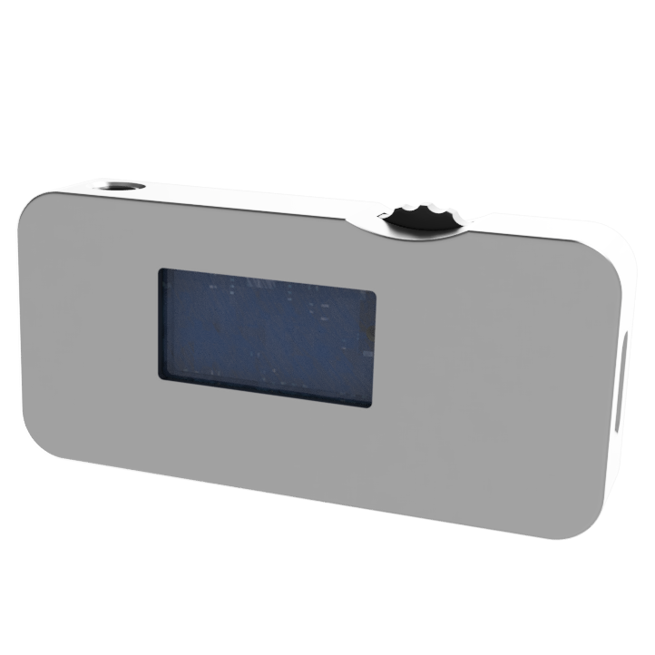

<p align="center">
  
</p>

<p align="center">
  <b>Talk to industrial devices from a browser tab.</b><br/>
  <b>在浏览器里直接调设备。</b><br/>
  <sub>Serial · WebSocket · MQTT · Modbus RTU · HART · custom protocols</sub>
</p>

<p align="center">
  <a href="https://modusignal.cn/"></a>
  <a href="./LICENSE.txt"></a>
  <a href="https://github.com/txp666/modusignal/stargazers"></a>
  <a href="https://github.com/txp666/modusignal/issues"></a>
  <a href="https://github.com/txp666/modusignal/commits"></a>
</p>

<p align="center">
  <a href="#english"><b>English</b></a> ·
  <a href="#中文"><b>中文</b></a> ·
  <a href="https://modusignal.cn/">Try it now →</a> ·
  <a href="https://github.com/txp666/modusignal/issues/new?title=%E6%96%B0%E8%AE%BE%E5%A4%87%E6%94%AF%E6%8C%81%E8%AF%B7%E6%B1%82">Request a device</a>
</p>

<p align="center">
  
</p>

---

<table>
  <tr>
    <td width="25%" align="center">
      <br/>
      <sub><b>AOMaster</b><br/>4-20 mA / 0-10 V<br/>6 waveforms</sub>
    </td>
    <td width="25%" align="center">
      <br/>
      <sub><b>HART</b><br/>vendor-agnostic<br/>PV / SV / TV / QV</sub>
    </td>
    <td width="25%" align="center">
      <br/>
      <sub><b>WebSocket</b><br/>JSON / HEX / Modbus<br/>+ live chart</sub>
    </td>
    <td width="25%" align="center">
      <br/>
      <sub><b>MQTT</b><br/>pub / sub · QoS<br/>retain · stats</sub>
    </td>
  </tr>
</table>

---

<a id="english"></a>

## What it is

A static web app for debugging serial / WebSocket / MQTT devices from a browser.
No installer, no backend, no database. Open the page, pick a device, connect, and you get raw frames, manual send, parsed values, and a real-time chart.

> Open a tab. Plug in a device. Talk to it.

## Use cases

- Bench-test a Modbus RTU board without firing up a 200 MB vendor tool
- Walk into a plant with a USB-to-485 dongle and a laptop, and you have a HART debugger
- Bring up a new MQTT/WebSocket-speaking device and watch traffic on a live curve
- Hand a colleague a URL instead of a `setup.exe`
- Build a quick UI for an in-house protocol with the *Custom device* page (no JS required)

Not what it's for: long-running data acquisition, plant monitoring, anything you'd actually call SCADA.

## Built-in devices

| Device | Transport | Default | Notes |
|--------|-----------|---------|-------|
| AOMaster | Serial | 115200 8N1 | 4-20 mA / 0-10 V signal source, 6 waveforms |
| Modbus RTU | Serial | 9600 8N1 | Read / write holding & input registers |
| HART | Serial | 1200 8O1 | Device search, universal commands, PV/SV/TV/QV |
| WebSocket | WebSocket | — | JSON / HEX / Modbus message debug |
| MQTT | MQTT over WS | — | Pub / sub, QoS, retain, message stats |
| Custom | any | — | Template + parser, no code |

Switching device also switches the transport and its defaults.

## Quick start

Serve the repo as static files:

```powershell
python -m http.server 4173
```

Open `http://localhost:4173` in Chrome or Edge. That's it — no install, no build.

To produce a deployable build:

```powershell
npm install
npm run build
npm run preview
```

The build script is `scripts/build.mjs` (esbuild). Output goes to `_site/`.

## Browser support

| Feature | Browsers |
|---------|----------|
| Serial (Web Serial API) | Chrome / Edge 89+, HTTPS or localhost |
| WebSocket | any modern browser |
| MQTT over WebSocket | any modern browser |

Firefox and Safari don't ship Web Serial, so serial devices won't work there. Everything else works.

## Architecture

```
index.html              app shell (topbar, sidebar, mount points)
pages/
  home.html             home and device grid
  request.html          new-device request form
  devices/              one HTML page per device
  shared/workbench.html shared log + chart panel
src/
  app.js                state, routing, events, device orchestration
  protocols.js          command / telemetry dispatch
  device-registry.js    device registry
  page-loader.js        async HTML fragment loader
  chart.js              Canvas 2D real-time chart
  echarts-charts.js     ECharts waveform preview
  config.js             app metadata
  transports/           serial / websocket / mqtt sessions
  devices/              per-device drivers
  modbus/modbus.js      Modbus RTU framing
  hart/hart.js          HART framing
  framing/              generic frame parsing (lines, header/tail, CRC16)
```

Devices and transports are kept separate. Adding a new device is usually: a driver file in `src/devices/`, an entry in `device-registry.js`, and a page in `pages/devices/`. See [`CONTRIBUTING.md`](./CONTRIBUTING.md) for details (the contributing guide is in Chinese).

## AOMaster register map

| Addr | R/W | Meaning |
|------|-----|---------|
| 0x0000 | R/W | Signal type (current / voltage) |
| 0x0001 | R/W | Waveform: 0=const 1=step 2=ramp 3=square 4=triangle 5=sine |
| 0x0002 | R/W | Setpoint / low value |
| 0x0003 | R/W | High value / step hold time |
| 0x0004 | R/W | Period (ms) / cycle count |
| 0x0005 | R/W | Duty cycle × 10 |
| 0x0006 | R   | Actual output (readback) |
| 0x0007+ | R/W | Step sequence values |

Default poll interval is 50 ms. In step mode the header is written first, then the sequence values.

## Custom device

If your device isn't built in, the *Custom* page lets you describe it without writing JS:

- Output range, unit, step
- Send template with `{value}`, `{value:2}`, `{unit}` placeholders
- Parser: regex, JSON path, HEX offset, Modbus payload
- Scaling: `parsed × scale + offset`

## Status

modusignal is actively maintained. New devices and parsers land regularly — see [open issues](https://github.com/txp666/modusignal/issues) for what's being discussed and feel free to chime in. If you'd like a device supported but don't want to write the driver yourself, [open a request](https://github.com/txp666/modusignal/issues/new?title=%E6%96%B0%E8%AE%BE%E5%A4%87%E6%94%AF%E6%8C%81%E8%AF%B7%E6%B1%82) with the protocol doc, sample frames, and default connection parameters.

## Contributing

PRs that add devices or improve existing drivers are welcome. Please read [`CONTRIBUTING.md`](./CONTRIBUTING.md) first (Chinese; English version coming).

## License

Apache License 2.0. See [`LICENSE.txt`](./LICENSE.txt).

If modusignal saved you an afternoon of fighting with a vendor installer, a star helps other people find it.

---

<a id="中文"></a>

## modusignal · 中文说明

浏览器里的设备调试台，纯静态前端，没有上位机要装、没有后端要起。打开网页、选设备、连上、看原始报文、手动发命令、看实时曲线，就这样。

> 一个标签页，一根线，跟设备直接对话。

## 适用场景

- 临时调一块 Modbus RTU 板子，不想装某厂家 200MB 的上位机
- 进车间带个 USB 转 485，笔记本插上就是 HART 调试工具
- 新设备走 WebSocket 或 MQTT，想边看流量边看曲线
- 把链接发给同事，比发 `setup.exe` 省事
- 内部协议没有现成工具，用 *自定义设备* 页面拼一个，不用写 JS

不适合：长时间数据采集、生产监控、SCADA。这是个调试工具。

## 内置设备

| 设备 | 传输 | 默认参数 | 说明 |
|------|------|----------|------|
| AOMaster | 串口 | 115200 8N1 | 4-20mA / 0-10V 信号源，6 种波形 |
| Modbus RTU | 串口 | 9600 8N1 | 读写保持 / 输入寄存器 |
| HART | 串口 | 1200 8O1 | 设备搜索、通用命令、PV/SV/TV/QV |
| WebSocket | WebSocket | — | JSON / HEX / Modbus 报文调试 |
| MQTT | MQTT over WS | — | 发布订阅、QoS、保留消息、统计 |
| 自定义设备 | 任意 | — | 模板 + 解析规则，无需写代码 |

切设备时通讯方式和参数会跟着自动切换。

## 跑起来

开发模式不用构建，起一个静态服务即可：

```powershell
python -m http.server 4173
```

用 Chrome / Edge 打开 `http://localhost:4173`。

要发布的话：

```powershell
npm install
npm run build
npm run preview
```

构建脚本是 `scripts/build.mjs`（基于 esbuild），产物在 `_site/`。

## 浏览器要求

| 功能 | 浏览器 |
|------|--------|
| 串口（Web Serial） | Chrome / Edge 89+，需要 HTTPS 或 localhost |
| WebSocket | 现代浏览器都行 |
| MQTT over WebSocket | 现代浏览器都行 |

Firefox 和 Safari 没有 Web Serial，串口设备用不了，其它功能正常。

## 项目结构

英文版的 `Architecture` 表已经列得很清楚了，这里不重复。简单说就是：设备层和传输层分开，加新设备 = 写一个驱动 + 注册 + 加一个页面，详见 [`CONTRIBUTING.md`](./CONTRIBUTING.md)。

## AOMaster 寄存器表

| 地址 | 读写 | 含义 |
|------|------|------|
| 0x0000 | R/W | 信号类型（电流 / 电压） |
| 0x0001 | R/W | 波形：0=恒定 1=阶跃 2=斜坡 3=方波 4=三角 5=正弦 |
| 0x0002 | R/W | 设定值 / 低值 |
| 0x0003 | R/W | 高值 / 阶跃保持时间 |
| 0x0004 | R/W | 周期（ms）/ 循环次数 |
| 0x0005 | R/W | 占空比 × 10 |
| 0x0006 | R | 实际输出（回读） |
| 0x0007+ | R/W | 步进序列值 |

默认轮询周期 50ms，步进模式先写头部再写序列值。

## 自定义设备

不想写 JS 也能配一个驱动出来：

- 输出范围、单位、步长
- 发送模板，支持 `{value}`、`{value:2}`、`{unit}` 占位符
- 解析规则：正则、JSON 路径、HEX 偏移、Modbus 载荷
- 数值换算：`解析值 × 比例 + 偏移`

## 项目状态

仍在持续迭代。新设备和解析能力会陆续加进来，欢迎在 [issues](https://github.com/txp666/modusignal/issues) 里讨论你想要的功能。需要新设备但不方便自己写驱动的，[提一个 issue](https://github.com/txp666/modusignal/issues/new?title=%E6%96%B0%E8%AE%BE%E5%A4%87%E6%94%AF%E6%8C%81%E8%AF%B7%E6%B1%82) 附上协议文档、报文样例和默认连接参数即可。

## 贡献

欢迎 PR 增加设备或修复驱动，提交前请看 [`CONTRIBUTING.md`](./CONTRIBUTING.md)。

## 许可证

[Apache License 2.0](./LICENSE.txt)。

如果 modusignal 帮你省下了一个下午跟厂家上位机较劲的时间，点个 star 能让更多人看到它。

---

<p align="center">
  <sub>by <a href="https://space.bilibili.com/509795217">飞起小鹏</a> · <a href="https://modusignal.cn/">modusignal.cn</a></sub>
</p>
